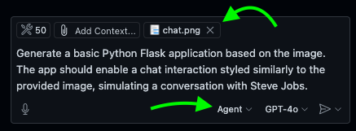
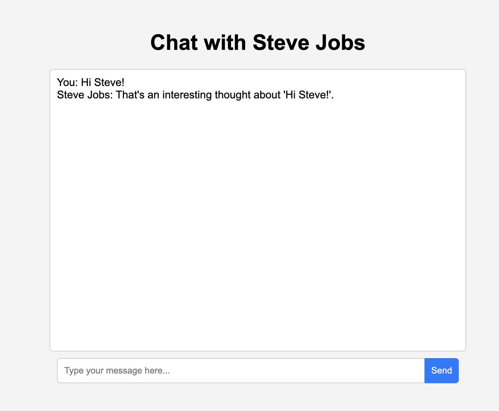
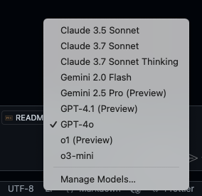
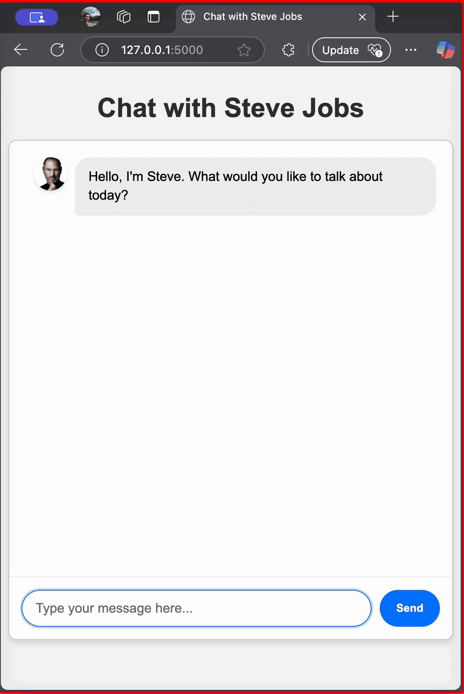

# Step-by-Step Guide

## Step 1: Initial Application Setup
Use the following initial prompt in GitHub Copilot Agent Mode:

**Prompt (include `chat.png`!):**



```prompt
Generate a basic Python Flask application based on the image. The app should enable a chat interaction styled similarly to the provided image, simulating a conversation with Steve Jobs.
```
- Copilot might ask for an empty workspace, use the predefined action to create `chat` directory, in the chat and cotinue.
- After copilot finished coding the initial chat app, explore the different files and run the app. It should look something like this:


## Step 2: Setting Up GitHub Copilot Agent Instructions

To enhance GitHub Copilot’s responses tailored specifically for this workshop, copy the file [copilot-instructions.md](/copilot-instructions.md) to the `.github` directory.

GitHub Copilot will automatically begin following these custom instructions, improving accuracy and relevance.

Now we can refine our application's UI:

**Prompt (include `chat.png` again):**
```prompt
Improve the page content, style, and layout based on the provided image. Ensure the chat window dynamically adapts to browser size. Add steve and user image to the user picture from the media directory. Overall I aim for a cleaner interface. Ensure Enter is send.
```
Confirm the interface is correctly updated upon running the Flask application.


## Step 3: Real-Time Chat with Azure OpenAI

GIthub Copilot has multiple models to use for writing code. Click on GPT-4o and explore the different offerings:



Now switch to `Claude 3.7 Sonnet`

**Prompt:**
```prompt
Integrate real-time chat functionality into the existing Flask application using Azure OpenAI’s GPT-4o. Utilize the latest openai Python package to interact with Azure OpenAI. Ensure the integration supports streaming responses for a seamless user experience. Handle authentication using Azure OpenAI credentials and manage API requests appropriately.
```


Fill the details in the `.env` file created in the root directory and replace the placeholder values with your actual Azure OpenAI details. 
Note! make sure the deployment name and the api versions are correct.

Install dependecies, run the app and test GPT-4o in real-time:



## Next Modules

1.  [Learn About Github Copilot](01-explore-github-copilot.md)
3. [Creating MCP Server](03-creating-mcp-server.md)