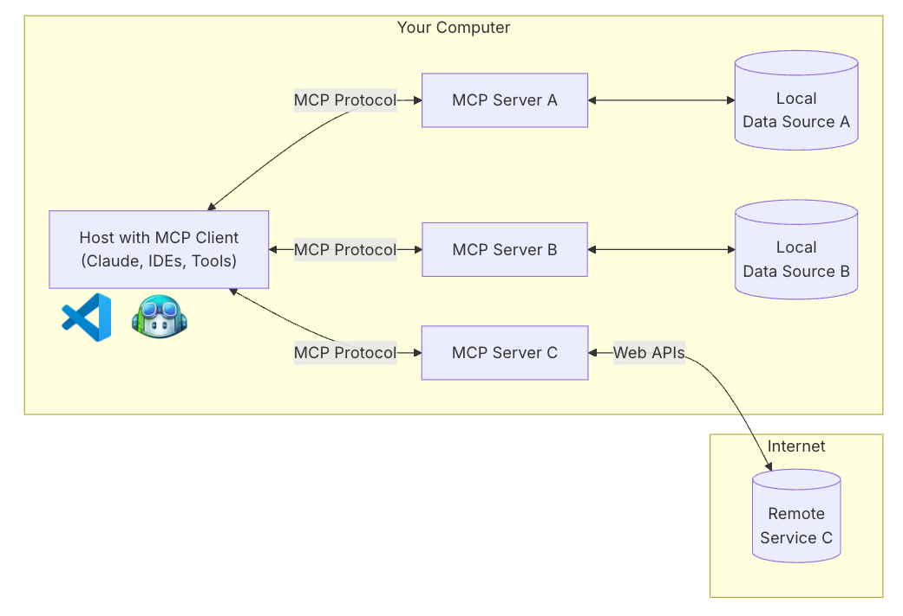
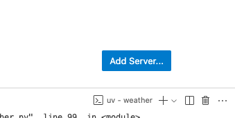
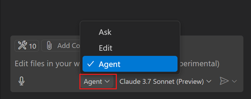
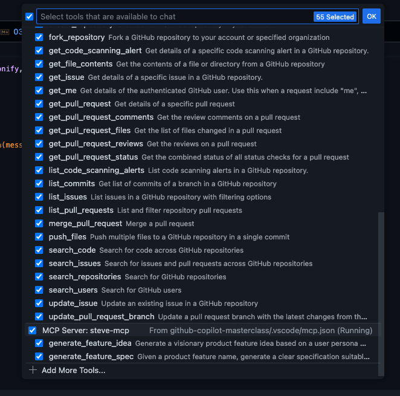
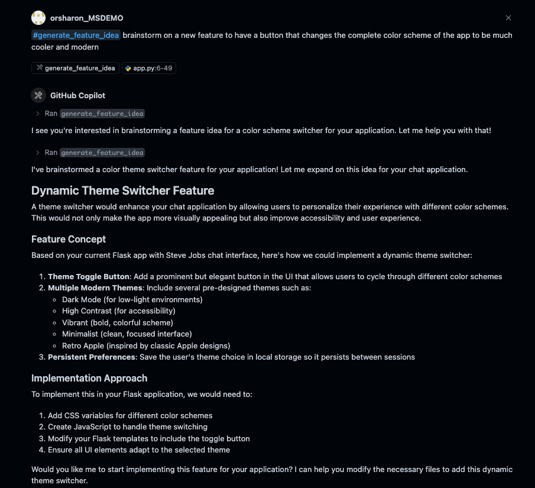
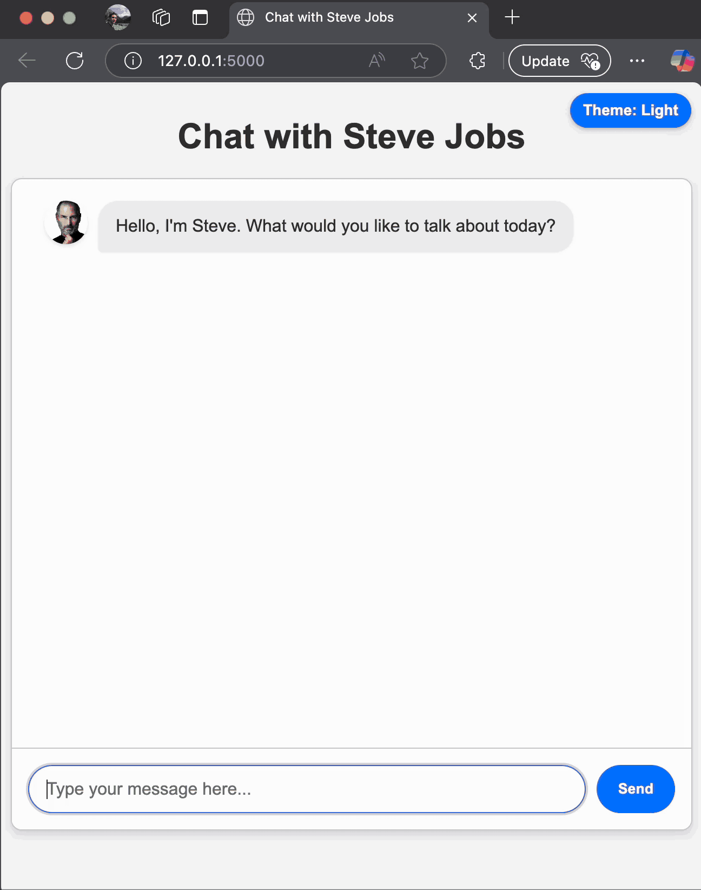

# Building a Steve Jobs Product Manager MCP Tool

## Model Context Protocol (MCP)
MCP is an open protocol that standardizes how applications provide context to LLMs. Think of MCP like a USB-C port for AI applications. Just as USB-C provides a standardized way to connect your devices to various peripherals and accessories, MCP provides a standardized way to connect AI models to different data sources and tools.

​
Why MCP?
MCP helps you build agents and complex workflows on top of LLMs. LLMs frequently need to integrate with data and tools, and MCP provides:
* A growing list of pre-built integrations that your LLM can directly plug into
* The flexibility to switch between LLM providers and vendors
* Best practices for securing your data within your infrastructure

#### Official MCP  Repository
Explore the following [link](https://github.com/modelcontextprotocol/servers) to see all official MCP servers.

### General Architecture

​MCP follows a client-server architecture where a host application can connect to multiple servers:


* **MCP Hosts**: Programs like Claude Desktop, IDEs, or AI tools that want to access data through MCP
* **MCP Clients**: Protocol clients that maintain 1:1 connections with servers
* **MCP Servers**: Lightweight programs that each expose specific capabilities through the standardized Model Context Protocol
* **Local Data Sources**: Your computer’s files, databases, and services that MCP servers can securely access
* **Remote Services**: External systems available over the internet (e.g., through APIs) that MCP servers can connect to


### MCP Server
**What we’ll be building**
Many LLMs do not currently have the ability to fetch the forecast and severe weather alerts. Let’s use MCP to solve that!

We’ll build a server that exposes two tools: get-alerts and get-forecast. Then we’ll connect the server to an MCP host

#### Core MCP Concepts
MCP servers can provide three main types of capabilities:

* **Resources**: File-like data that can be read by clients (like API responses or file contents)
* **Tools**: Functions that can be called by the LLM (with user approval)
* **Prompts**: Pre-written templates that help users accomplish specific tasks

## Lets Go!

### 1. Install uv and set up our Python project and environment

install uv and restart terminal
```bash
curl -LsSf https://astral.sh/uv/install.sh | sh
```

### 2. Create and set up our project
```bash
# Create a new directory for our project
uv init steve-mcp --no-workspace
cd steve-mcp

# Create virtual environment and activate it
uv venv
source .venv/bin/activate

# Install dependencies
uv add "mcp[cli]" httpx openai dotenv

# Create our server file
touch steve-mcp.py
```

### 3. Add this code to the your `steve-mcp.py` file
```python
#!/usr/bin/env python3

import json
import os
from typing import Dict, Any

from mcp.server.fastmcp import FastMCP
from openai import AzureOpenAI
from dotenv import load_dotenv

# Load environment variables from .env file
load_dotenv()

# Configure Azure OpenAI client
azure_client = AzureOpenAI(
    api_key=os.getenv("AZURE_OPENAI_API_KEY", ""),
    api_version=os.getenv("AZURE_OPENAI_API_VERSION", "2024-04-01-preview"),
    azure_endpoint=os.getenv("AZURE_OPENAI_ENDPOINT", ""),
)
deployment_name = os.getenv("AZURE_OPENAI_DEPLOYMENT", "gpt-4o")

# Initialize FastMCP server
mcp = FastMCP("steve-mcp")

# Tool implementations
async def generate_feature_idea_implementation(user_type: str) -> Dict[str, Any]:
    """
    Generate a visionary product feature idea based on a user persona or type.
    
    Args:
        user_type: The type of user or persona to generate a feature for
        
    Returns:
        Dictionary with feature title and description in Jobs-like tone
    """
    prompt = f"""
    You are Steve Jobs, envisioning the next revolutionary feature for {user_type}.
    Think about what these users truly need (not what they say they want).
    Create a feature that is elegant, simple yet powerful, and genuinely changes how people work.
    
    Respond with a JSON object containing:
    1. "title": A short, catchy name for the feature (max 6 words)
    2. "description": A brief explanation of the feature in Steve Jobs' visionary tone (2-3 sentences)
    
    Format the response as valid JSON only.
    """
    
    # Call Azure OpenAI to generate the feature idea
    response = azure_client.chat.completions.create(
        model=deployment_name,
        messages=[
            {"role": "system", "content": "You are Steve Jobs, the visionary product leader."},
            {"role": "user", "content": prompt}
        ],
        response_format={"type": "json_object"},
        temperature=0.7,
        max_tokens=300
    )
    
    # Parse the response
    result = json.loads(response.choices[0].message.content)
    return result


async def generate_feature_spec_implementation(title: str) -> Dict[str, Any]:
    """
    Given a product feature name, generate a clear specification suitable for GitHub Copilot development.
    
    Args:
        title: The title of the feature to specify
        
    Returns:
        Dictionary with structured specification
    """
    prompt = f"""
    You are Steve Jobs, writing a clear, visionary specification for a feature called "{title}".
    Create a specification that will inspire developers while providing enough clarity for GitHub Copilot to implement.
    
    Respond with a JSON object containing:
    1. "problem": What problem does this solve? (1-2 sentences)
    2. "solution": What is the core solution? (2-3 sentences)
    3. "design_principles": What design principles should guide the implementation? (3-5 bullet points)
    4. "implementation_notes": Technical implementation guidance for GitHub Copilot (3-5 bullet points)
    
    Format the response as valid JSON only.
    """
    
    # Call Azure OpenAI to generate the feature spec
    response = azure_client.chat.completions.create(
        model=deployment_name,
        messages=[
            {"role": "system", "content": "You are Steve Jobs, the visionary product leader."},
            {"role": "user", "content": prompt}
        ],
        response_format={"type": "json_object"},
        temperature=0.7,
        max_tokens=800
    )
    
    # Parse the response
    result = json.loads(response.choices[0].message.content)
    return result


# ----- Define MCP tools using decorator approach -----

@mcp.tool()
async def generate_feature_idea(user_type: str) -> str:
    """Generate a visionary product feature idea based on a user persona or type.
    
    Args:
        user_type: The type of user or persona to generate a feature for
    """
    try:
        result = await generate_feature_idea_implementation(user_type)
        return f"# {result['title']}\n\n{result['description']}"
    except Exception as e:
        return f"Error generating feature idea: {str(e)}"


@mcp.tool()
async def generate_feature_spec(title: str) -> str:
    """Given a product feature name, generate a clear specification suitable for GitHub Copilot development.
    
    Args:
        title: The title of the feature to specify
    """
    try:
        result = await generate_feature_spec_implementation(title)
        
        # Format the response as markdown
        markdown = f"""
# {title} - Feature Specification

## Problem
{result['problem']}

## Solution
{result['solution']}

## Design Principles
{' '.join(['- ' + principle + '\n' for principle in result['design_principles']])}

## Implementation Notes for GitHub Copilot
{' '.join(['- ' + note + '\n' for note in result['implementation_notes']])}
"""
        
        return markdown.strip()
    except Exception as e:
        return f"Error generating feature spec: {str(e)}"


# Running the server
if __name__ == "__main__":
    # Initialize and run the server
    mcp.run(transport='stdio')
```


Make sure the .env file has values. Sample:
```env
# Azure OpenAI Configuration
AZURE_OPENAI_API_KEY=<api-key>
AZURE_OPENAI_ENDPOINT=https://<azure-openai-name>.openai.azure.com/
AZURE_OPENAI_DEPLOYMENT=<model-deploymeny-name>
```
Run `uv run steve-mcp.py` to confirm that everything’s working. (if nothing happens its working)
> **Note:** 
> 1. The FastMCP class leverages Python type hints and docstrings to automatically generate tool definitions. This approach simplifies both the creation and maintenance of MCP tools by ensuring clear, descriptive, and consistent tool interfaces.
> 2. Helper functions are for querying and formatting the data
> 3. The tool execution handler is responsible for actually executing the logic of each tool.


### 4. Add MCP Server to VSCode
The configuration of an MCP server is in the .vscode/mcp.json file in your workspace, so you can share configurations with project collaborators. You have two options to add a new MCP server configuration:

#### Option 1: Manual Configuration
1. Create a `.vscode/mcp.json` file in your workspace.
2. Insert the following JSON template:
    ```json
    {
        "servers": {
            "steve-mcp": {
                "type": "stdio",
                "command": "uv",
                "args": [
                    "--directory",
                    "/ABSOLUTE/PATH/TO/PARENT/FOLDER/steve-mcp",
                    "run",
                    "steve-mcp.py"
                ]
            }
        }
    }
    ```
3. Save the file to apply the configuration.

#### Option 2: Using the VSCode Interface
1. Create the `.vscode/mcp.json` manually and use the button in the bottom right side of the screen.  
    
2. Alternatively, run the MCP: Add Server command from the Command Palette and provide the server information to add a new MCP server configuration

> **Note:** you can explore the following [link](https://code.visualstudio.com/docs/copilot/chat/mcp-servers) to see all configuration options for MCP servers in VSCode.
### 5. Use MCP tools in agent mode
Once you have added an MCP server, you can use the tools it provides in agent mode. To use MCP tools in agent mode:
1. Open the Chat view (⌃⌘I), and select **Agent** mode from the dropdown.  
    
2. Select the Tools button to view the list of available tools.  
    
3. Test the server by running:
    - `#generate_feature_idea brainstorm on a new feature to have a button that changes the complete color scheme of the app to be much cooler and modern`



4. Check out the new feature it developed, in my case:



## Getting Started
1.  [Learn About Github Copilot](01-explore-github-copilot.md)
2. [Jump Directly to the Workshop](02-application-setup.md)
---


## Additional Resources
- https://github.com/github/github-mcp-server
- https://modelcontextprotocol.io/introduction
- https://code.visualstudio.com/docs/copilot/chat/mcp-servers