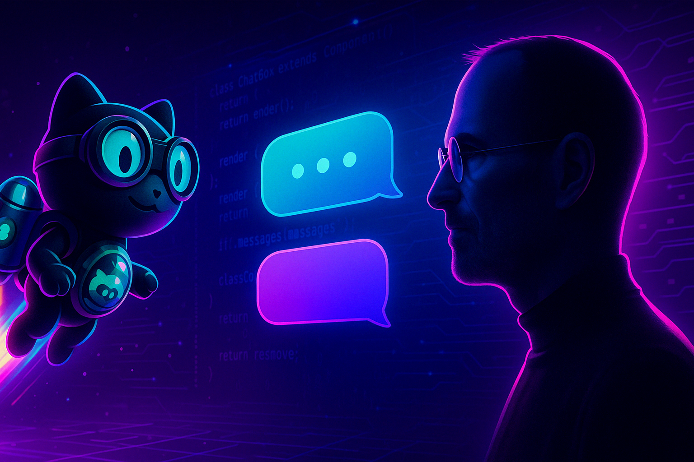
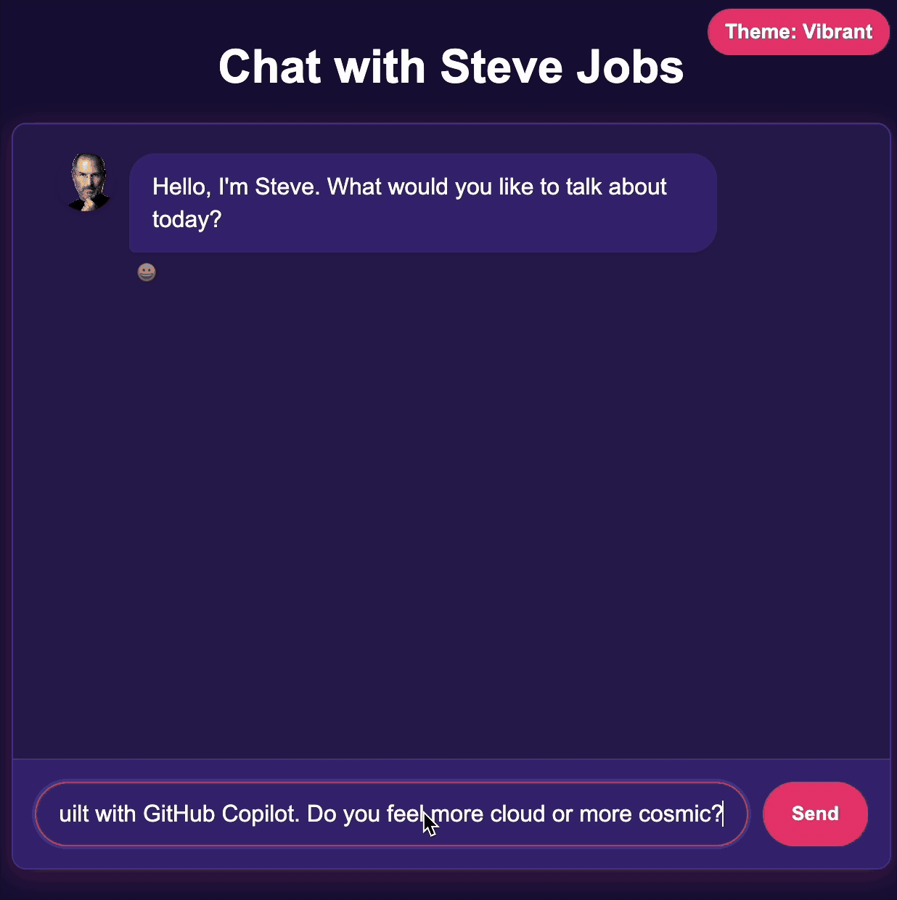

# Workshop: Build a Chat App with Steve Jobs Using GitHub Copilot Agent Mode

    

## Overview

In this hands-on workshop, you'll build an interactive chat application featuring a virtual Steve Jobs, powered by Azure OpenAI's GPT-4o. GitHub Copilot's Agent Mode will guide you through the entire development process, showcasing how AI can accelerate and enhance your coding workflow.

    

## What You'll Create

- **AI Chat Application**: A Flask-based web application that lets you have conversations with a virtual Steve Jobs
- **Custom MCP Server**: A Model Context Protocol server that provides specialized Steve Jobs product management tools
- **End-to-End Development Experience**: From concept to deployment using GitHub Copilot Agent Mode

## What You'll Learn

- How to use GitHub Copilot's Agent Mode to accelerate development
- Techniques for integrating Azure OpenAI's GPT-4o with streaming responses
- Creating custom MCP servers to enhance GitHub Copilot's capabilities
- Implementing real-time chat functionality in a web application
- Styling and optimizing a responsive web interface

## Prerequisites

- GitHub Copilot with Agent Mode enabled
- Python 3.8+ installed on your machine
- Azure OpenAI Service access (specifically with GPT-4o model deployment)
- Visual Studio Code with Copilot Chat extension
- Basic knowledge of Python and web development concepts

## Workshop Modules

1. [Explore GitHub Copilot](01-explore-github-copilot.md) - Learn about Copilot's features, models, and prompt engineering techniques
2. [Build Your Application](02-application-setup.md) - Create a Flask-based chat interface and integrate it with Azure OpenAI
3. [Create Your MCP Server](03-creating-mcp-server.md) - Build a custom tool to extend Copilot with Steve Jobs-inspired product management capabilities

## Getting Started

To begin the workshop, start with the first module above or jump directly to building the application if you're already familiar with GitHub Copilot.

The final application will allow you to:
- Chat with a virtual Steve Jobs powered by Azure OpenAI
- Generate product ideas and specifications in Steve Jobs' style
- Experience the power of AI-assisted development workflows

Let's start building something insanely great!
