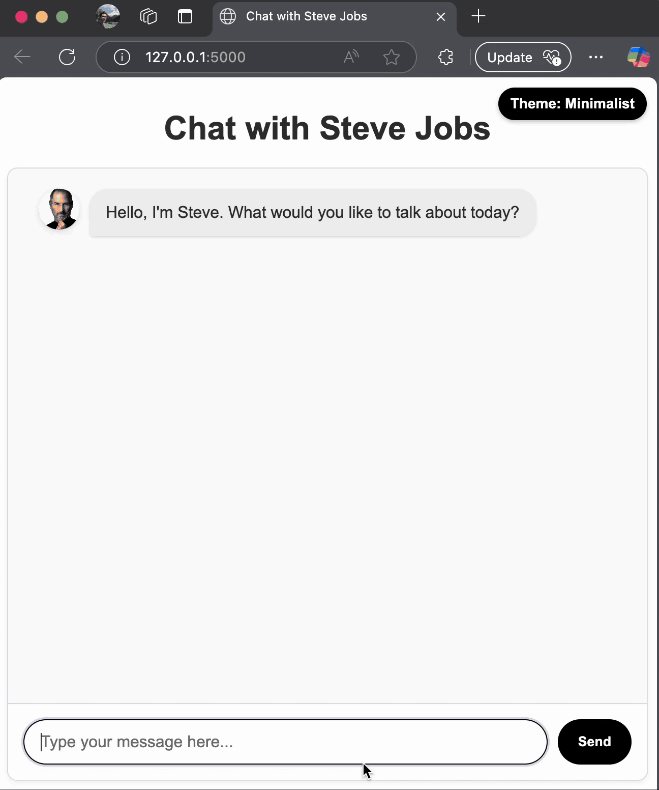

# Workshop: Build a Chat App with Steve Jobs Using GitHub Copilot Agent Mode

In this hands-on workshop, you'll create an interactive chat application featuring Steve Jobs, powered by Azure OpenAI's GPT-4o, and assisted by GitHub Copilot Agent Mode.

At the end of this workshop, you'll have a messaging app to speak with Steve Jobs in addition to "Steve Jobs Product Manager" in you VSCode (or any mcp client) to help you design and code a new feature.

## Prerequisites
- GitHub Copilot activated and configured in Agent Mode
- Python and Flask installed
- Azure OpenAI with GPT-4o credentials

## Getting Started
1.  [Learn About Github Copilot](01-explore-github-copilot.md)
2. [Jump Directly to the Workshop](02-application-setup.md)
3. [Creating MCP Server](03-creating-mcp-server.md)

---

You have now completed your workshop setup and are ready to enjoy a seamless, interactive chat experience with Steve Jobs!

