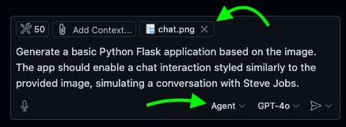
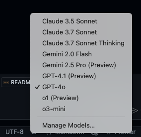
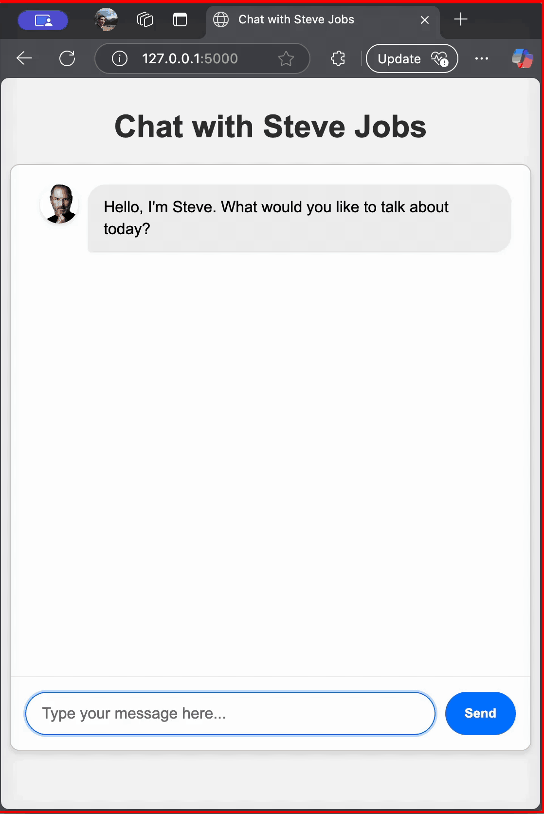
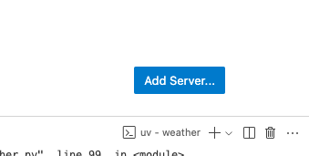

# Workshop: Build a Chat App with Steve Jobs Using GitHub Copilot Agent Mode


In this hands-on workshop, you'll create an interactive chat application featuring Steve Jobs, powered by Azure OpenAI's GPT-4o, and assisted by GitHub Copilot Agent Mode.

## Prerequisites
- GitHub Copilot activated and configured in Agent Mode
- Python and Flask installed
- Azure OpenAI with GPT-4o credentials

## Step-by-Step Guide

### Step 1: Initial Application Setup
Use the following initial prompt in GitHub Copilot Agent Mode:

**Prompt (include `chat.png`!):**



Prompt: > Generate a basic Python Flask application based on the image. The app should enable a chat interaction styled similarly to the provided image, simulating a conversation with Steve Jobs.

- Copilot might ask for an empty workspace, use the predefined action to create `chat` directory, in the chat and cotinue.
- After copilot finished coding the initial chat app, explore the different files and run the app. It should look something like this:


### Step 2: Setting Up GitHub Copilot Agent Instructions

To enhance GitHub Copilot’s responses tailored specifically for this workshop, copy the file [copilot-instructions.md](/copilot-instructions.md) to the `.github` directory.

GitHub Copilot will automatically begin following these custom instructions, improving accuracy and relevance.

Now we can refine our application's UI:

**Prompt (include `chat.png` again):**

> Improve the page content, style, and layout based on the provided image. Ensure the chat window dynamically adapts to browser size. Add steve and user image to the user picture from the media directory. Overall I aim for a cleaner interface. Ensure Enter is send.

Confirm the interface is correctly updated upon running the Flask application.


### Step 3: Real-Time Chat with Azure OpenAI

GIthub Copilot has multiple models to use for writing code. Click on GPT-4o and explore the different offerings:



Now switch to `Claude 3.7 Sonnet`

**Prompt:**

> Integrate real-time chat functionality into the existing Flask application using Azure OpenAI’s GPT-4o. Utilize the latest openai Python package to interact with Azure OpenAI. Ensure the integration supports streaming responses for a seamless user experience. Handle authentication using Azure OpenAI credentials and manage API requests appropriately.


Fill the details in the `.env` file created in the root directory and replace the placeholder values with your actual Azure OpenAI details. 
Note! make sure the deployment name and the api versions are correct.

Install dependecies, run the app and test GPT-4o in real-time:




## Model Context Protocol (MCP)
MCP is an open protocol that standardizes how applications provide context to LLMs. Think of MCP like a USB-C port for AI applications. Just as USB-C provides a standardized way to connect your devices to various peripherals and accessories, MCP provides a standardized way to connect AI models to different data sources and tools.

​
Why MCP?
MCP helps you build agents and complex workflows on top of LLMs. LLMs frequently need to integrate with data and tools, and MCP provides:
* A growing list of pre-built integrations that your LLM can directly plug into
* The flexibility to switch between LLM providers and vendors
* Best practices for securing your data within your infrastructure

#### Official MCP  Repository
Explore the following [link](https://github.com/modelcontextprotocol/servers) to see all official MCP servers.

### General Architecture

​MCP follows a client-server architecture where a host application can connect to multiple servers:


* **MCP Hosts**: Programs like Claude Desktop, IDEs, or AI tools that want to access data through MCP
* **MCP Clients**: Protocol clients that maintain 1:1 connections with servers
* **MCP Servers**: Lightweight programs that each expose specific capabilities through the standardized Model Context Protocol
* **Local Data Sources**: Your computer’s files, databases, and services that MCP servers can securely access
* **Remote Services**: External systems available over the internet (e.g., through APIs) that MCP servers can connect to


### MCP Server
**What we’ll be building**
Many LLMs do not currently have the ability to fetch the forecast and severe weather alerts. Let’s use MCP to solve that!

We’ll build a server that exposes two tools: get-alerts and get-forecast. Then we’ll connect the server to an MCP host

#### Core MCP Concepts
MCP servers can provide three main types of capabilities:

* **Resources**: File-like data that can be read by clients (like API responses or file contents)
* **Tools**: Functions that can be called by the LLM (with user approval)
* **Prompts**: Pre-written templates that help users accomplish specific tasks

### 1. Install uv and set up our Python project and environment

install uv and restart terminal
```bash
curl -LsSf https://astral.sh/uv/install.sh | sh
```

### 2. Create and set up our project
```bash
# Create a new directory for our project
uv init weather --no-workspace
cd weather

# Create virtual environment and activate it
uv venv
source .venv/bin/activate

# Install dependencies
uv add "mcp[cli]" httpx

# Create our server file
touch weather.py
```

### 3. Add this code to the your `weather.py` file
```python
from typing import Any
import httpx
from mcp.server.fastmcp import FastMCP

# Initialize FastMCP server
mcp = FastMCP("weather")

# Constants
NWS_API_BASE = "https://api.weather.gov"
USER_AGENT = "weather-app/1.0"

# HELPER TOOLS
#  helper functions for querying and formatting the data from the National Weather Service API
async def make_nws_request(url: str) -> dict[str, Any] | None:
    """Make a request to the NWS API with proper error handling."""
    headers = {
        "User-Agent": USER_AGENT,
        "Accept": "application/geo+json"
    }
    async with httpx.AsyncClient() as client:
        try:
            response = await client.get(url, headers=headers, timeout=30.0)
            response.raise_for_status()
            return response.json()
        except Exception:
            return None

def format_alert(feature: dict) -> str:
    """Format an alert feature into a readable string."""
    props = feature["properties"]
    return f"""
Event: {props.get('event', 'Unknown')}
Area: {props.get('areaDesc', 'Unknown')}
Severity: {props.get('severity', 'Unknown')}
Description: {props.get('description', 'No description available')}
Instructions: {props.get('instruction', 'No specific instructions provided')}
"""

# EXCECUTION TOOLS
# The tool execution handler is responsible for actually executing the logic of each tool.
@mcp.tool()
async def get_alerts(state: str) -> str:
    """Get weather alerts for a US state.

    Args:
        state: Two-letter US state code (e.g. CA, NY)
    """
    url = f"{NWS_API_BASE}/alerts/active/area/{state}"
    data = await make_nws_request(url)

    if not data or "features" not in data:
        return "Unable to fetch alerts or no alerts found."

    if not data["features"]:
        return "No active alerts for this state."

    alerts = [format_alert(feature) for feature in data["features"]]
    return "\n---\n".join(alerts)

@mcp.tool()
async def get_forecast(latitude: float, longitude: float) -> str:
    """Get weather forecast for a location.

    Args:
        latitude: Latitude of the location
        longitude: Longitude of the location
    """
    # First get the forecast grid endpoint
    points_url = f"{NWS_API_BASE}/points/{latitude},{longitude}"
    points_data = await make_nws_request(points_url)

    if not points_data:
        return "Unable to fetch forecast data for this location."

    # Get the forecast URL from the points response
    forecast_url = points_data["properties"]["forecast"]
    forecast_data = await make_nws_request(forecast_url)

    if not forecast_data:
        return "Unable to fetch detailed forecast."

    # Format the periods into a readable forecast
    periods = forecast_data["properties"]["periods"]
    forecasts = []
    for period in periods[:5]:  # Only show next 5 periods
        forecast = f"""
{period['name']}:
Temperature: {period['temperature']}°{period['temperatureUnit']}
Wind: {period['windSpeed']} {period['windDirection']}
Forecast: {period['detailedForecast']}
"""
        forecasts.append(forecast)

    return "\n---\n".join(forecasts)

# Running the server
if __name__ == "__main__":
    # Initialize and run the server
    mcp.run(transport='stdio')
```

Run `uv run weather.py` to confirm that everything’s working.
> **Note:** 
> 1. The FastMCP class leverages Python type hints and docstrings to automatically generate tool definitions. This approach simplifies both the creation and maintenance of MCP tools by ensuring clear, descriptive, and consistent tool interfaces.
> 2. Helper functions (`make_nws_request`,`format_alert`) for querying and formatting the data from the National Weather Service API
> 3. The tool execution handler (`get_alerts`,`get_forecast`) is responsible for actually executing the logic of each tool.


### 4. Add MCP Server to VSCode
The configuration of an MCP server is in the .vscode/mcp.json file in your workspace, so you can share configurations with project collaborators. You have two options to add a new MCP server configuration:

#### Option 1: Manual Configuration
1. Create a `.vscode/mcp.json` file in your workspace.
2. Insert the following JSON template:
    ```json
    {
        "servers": {
            "weather": {
                "type": "stdio",
                "command": "uv",
                "args": [
                    "--directory",
                    "/ABSOLUTE/PATH/TO/PARENT/FOLDER/weather",
                    "run",
                    "weather.py"
                ]
            }
        }
    }
    ```
3. Save the file to apply the configuration.

#### Option 2: Using the VSCode Interface
1. Create the `.vscode/mcp.json` manually and use the button in the bottom right side of the screen.  
    
2. Alternatively, run the MCP: Add Server command from the Command Palette and provide the server information to add a new MCP server configuration

> **Note:** you can explore the following [link](https://code.visualstudio.com/docs/copilot/chat/mcp-servers) to see all configuration options for MCP servers in VSCode.
### 5. Use MCP tools in agent mode
Once you have added an MCP server, you can use the tools it provides in agent mode. To use MCP tools in agent mode:
1. Open the Chat view (⌃⌘I), and select **Agent** mode from the dropdown.  
    
2. Select the Tools button to view the list of available tools.  
    
3. Test the server by running:
    - `What’s the weather in Sacramento?`
    - `What are the active weather alerts in Texas?`
    - 


---

You have now completed your workshop setup and are ready to enjoy a seamless, interactive chat experience with Steve Jobs!


## Useful Links:
#### MCP
- https://github.com/github/github-mcp-server
- https://modelcontextprotocol.io/introduction
- https://code.visualstudio.com/docs/copilot/chat/mcp-servers

